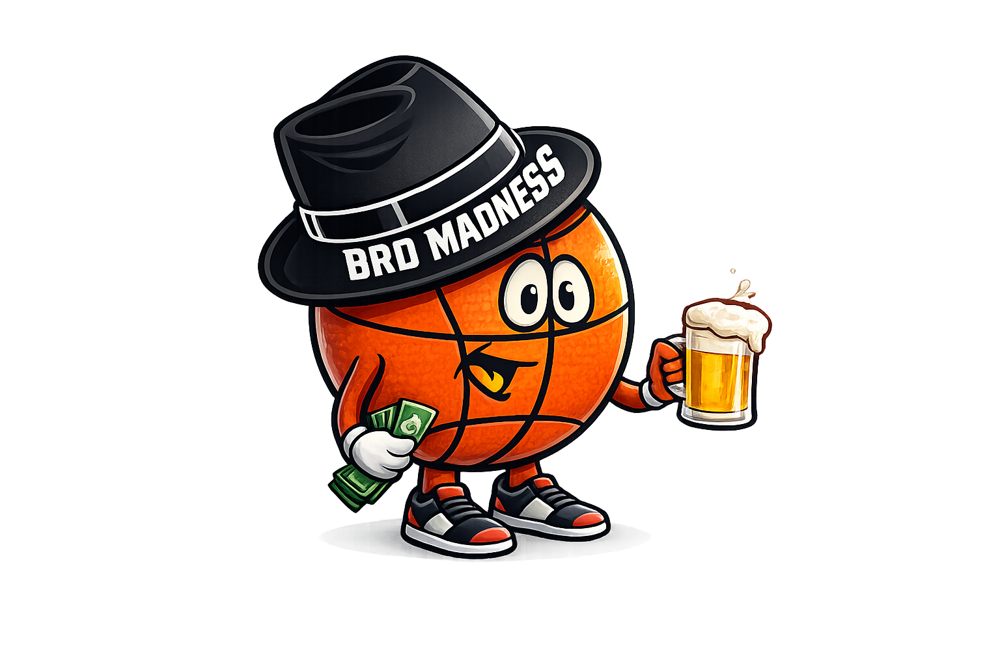
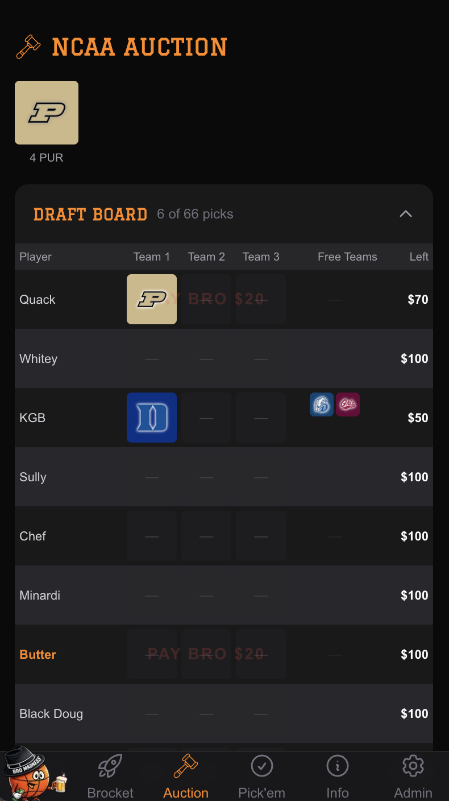
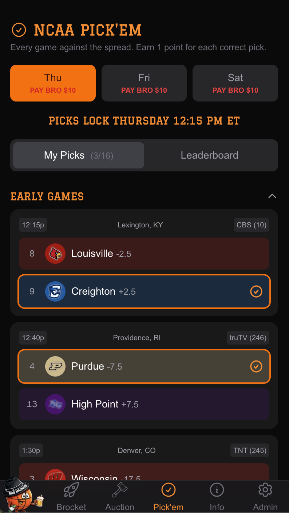
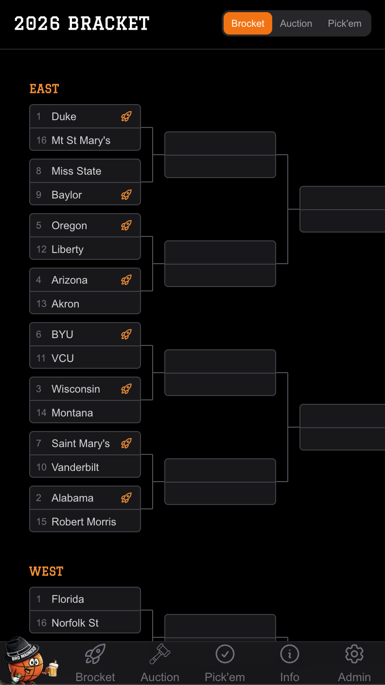
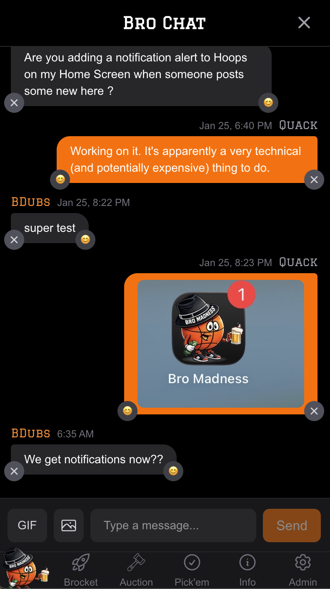
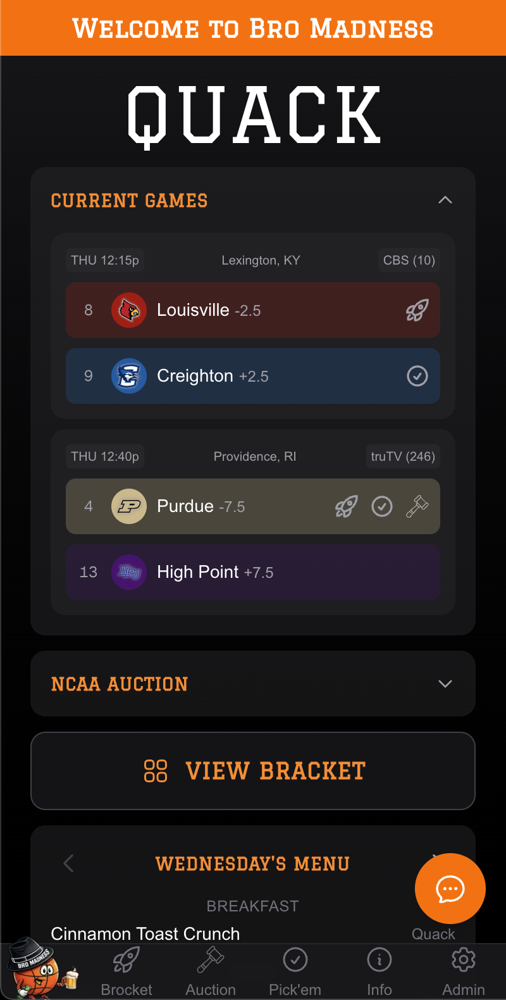
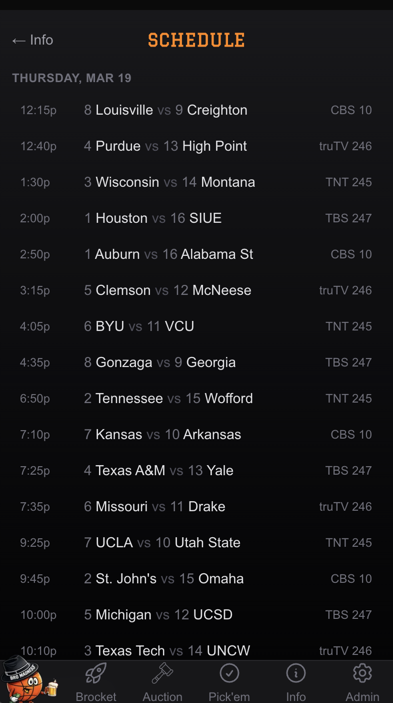
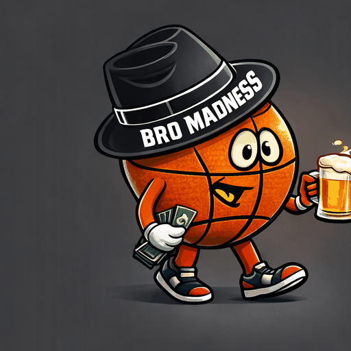

# Bro Madness

<div align="center">
  

  **The Ultimate March Madness Companion for Friends**

  A comprehensive web platform for managing bracket pools, auctions, pick'em games, and more during the NCAA Tournament.
</div>

---

## What is Bro Madness?

Bro Madness is an all-in-one March Madness gaming platform built for groups of friends who want to make the tournament more exciting. Whether you're gathering for a tournament trip or competing remotely, Bro Madness provides multiple ways to compete, chat, and track the action in real-time.

### Key Highlights

- **Multiple Game Types** - Auction drafts, daily pick'em, straight-up brackets
- **Real-Time Updates** - Live scores, bracket updates, and instant leaderboards
- **Built-In Chat** - Stay connected with GIFs, photos, and emoji reactions
- **Mobile-First PWA** - Install on your phone for a native app experience
- **Push Notifications** - Never miss a message or important update

---

## Features

### NCAA Auction


A fantasy-style auction where players bid on tournament teams with a $100 salary cap.

- **Live Bidding** - Real-time auction with $5 minimum bid increments
- **Underdog Rewards** - Points = Seed × Wins (a #16 seed win = 16 points!)
- **Draft Board** - Visual display of auction order and team assignments
- **Dynamic Payouts** - Prize pool split among championship owner, runner-up owner, and top point scorers



---

### Daily Pick'em


Make your picks against the spread for Thursday and Friday games.

- **Straight-Up Picks** - Pick winners for each game
- **Session-Based** - Separate competitions for each game day
- **Leaderboards** - Track standings with tiebreaker logic
- **Game Locking** - Individual games lock at tip-off



---

### Brocket (Straight-Up Bracket)


Predict all 32 first-round games straight-up before the tournament begins.

- **Round 1 Focus** - All 32 opening round games
- **Regional Organization** - 8 games per region
- **Lock at Tip** - All picks lock when the first game starts
- **Simple Scoring** - 1 point per correct pick


---

### Interactive Bracket

A beautiful, full tournament bracket with rich information overlays.

- **Complete Visualization** - All 63 games across 6 rounds
- **Live Scores** - Real-time score updates as games finish
- **Pick Overlays** - See your pick'em and brocket selections on the bracket
- **Ownership Display** - Shows who owns each team from the auction
- **Team Colors** - Authentic team colors for every school



---

### Real-Time Chat

Stay connected with your group throughout the tournament.

- **Instant Messaging** - Real-time message delivery
- **GIF Support** - Built-in GIPHY integration with search
- **Photo Sharing** - Upload and share images with automatic compression
- **Emoji Reactions** - React to messages with emojis
- **Push Notifications** - Get notified when messages arrive



---

### Home Dashboard

Your personalized tournament hub with everything at a glance.

- **Personal Greeting** - See your winnings and balance
- **Current Games** - Games happening in the next few hours
- **Your Teams** - Track your auction teams' progress and points
- **Today's Menu** - What's for dinner during the trip
- **Quick Actions** - Jump to bracket, picks, or chat instantly



---

### Game Schedule

Complete tournament schedule with results.

- **Chronological View** - Games organized by date and time
- **TV Channels** - Know where to watch each game
- **Final Scores** - Results update in real-time
- **Winner Highlighting** - Easy visual identification of winners

---

### Trip Menu

For tournament viewing trips, track all the food and drinks.

- **Daily Organization** - Wednesday through Sunday
- **Meal Categories** - Breakfast, lunch, dinner, snacks
- **Provider Info** - Who's bringing what

---

### Comprehensive Rules

Detailed documentation for all game types.

- **3's & D's** - Score tracking for 3-pointers, dunks, and air balls
- **1st to 10** - Racing to score milestones
- **Digits** - Matching final score digits
- **All Pool Games** - Complete rules and payout structures

---

## Tech Stack

<div align="center">

| Category | Technology |
|----------|------------|
| **Framework** | Next.js 16 (App Router) |
| **Language** | TypeScript 5 |
| **UI Library** | React 19 |
| **Styling** | Tailwind CSS 4 |
| **Database** | Supabase (PostgreSQL) |
| **Real-Time** | Supabase Realtime |
| **Auth** | Supabase Auth |
| **Push Notifications** | Web Push API |
| **Image Processing** | Sharp |
| **Deployment** | Vercel |

</div>

---

## Architecture

```
bromadness.com/
├── app/                    # Next.js App Router pages
│   ├── admin/              # Admin dashboard & management
│   ├── auction/            # NCAA auction game
│   ├── bracket/            # Tournament bracket viewer
│   ├── brocket/            # Straight-up bracket game
│   ├── chat/               # Real-time messaging
│   ├── menu/               # Trip food/drink menu
│   ├── pickem/             # Daily pick'em game
│   ├── rules/              # Game rules documentation
│   └── schedule/           # Tournament schedule
├── components/             # Reusable React components
├── lib/                    # Utilities & Supabase clients
├── public/                 # Static assets
│   ├── logos/              # 350+ D1 team logos
│   └── icons/              # PWA icons
└── types/                  # TypeScript type definitions
```

---

## Key Capabilities

### Real-Time Everything
- Live chat with instant message delivery
- Bracket updates as games complete
- Leaderboard changes reflected immediately
- Push notifications for important events

### Mobile-First Design
- Responsive layouts that work on any device
- PWA support for home screen installation
- Safe area handling for modern phones
- Touch-optimized interactions

### Admin Control Center
- Manage auctions (start, pause, reset)
- Enter game results
- Track payments and payouts
- Moderate chat messages
- Configure all game settings

### Smart Scoring
- Automatic point calculations
- Tiebreaker logic
- Potential points tracking
- Historical data preservation

---

## Screenshots

> **Note:** Add your own screenshots to `docs/screenshots/` to showcase the app.

| Home | Bracket | Auction |
|------|---------|---------|
|  |  |  |

| Pick'em | Chat | Schedule |
|---------|------|----------|
|  |  |  |

---

## Getting Started

### Prerequisites

- Node.js 18+
- npm, yarn, pnpm, or bun
- Supabase account

### Installation

1. Clone the repository:
```bash
git clone https://github.com/yourusername/bromadness.com.git
cd bromadness.com
```

2. Install dependencies:
```bash
npm install
```

3. Set up environment variables:
```bash
cp .env.example .env.local
```

Add your Supabase credentials:
```
NEXT_PUBLIC_SUPABASE_URL=your_supabase_url
NEXT_PUBLIC_SUPABASE_ANON_KEY=your_anon_key
SUPABASE_SERVICE_ROLE_KEY=your_service_role_key
```

4. Run the development server:
```bash
npm run dev
```

5. Open [http://localhost:3000](http://localhost:3000)

---

## Deployment

The app is optimized for deployment on Vercel:

```bash
vercel deploy
```

Or connect your GitHub repository for automatic deployments.

---

## License

This project is private and intended for personal use among friends.

---

<div align="center">
  

  **Built with love for March Madness**

  *May your brackets be blessed and your underdogs victorious*
</div>
